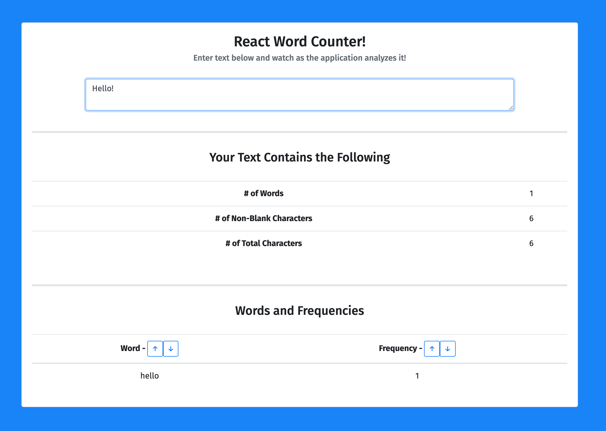
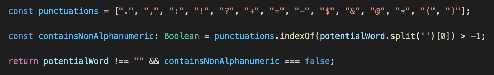

# React Word Counter 

## An application that analyzes and counts words


<p align = 'center'>
    
</p>


### Running the Application
- To run this application locally navigate into it's directory and run the following 

```
npm install && yarn start
```

- If you would like to build the application simply run

```
npm install && yarn build
```

### About
- This application is a light weight purely client-side application built with React and Typescript as requested.
    - Functional components were used as they have faster rendering speeds and there was no apparent use for props or any parent-child component data flow 
    - Data that had to be stored was stored in local state with the use of 'useState()' React hooks

### How it works
- This application works by analyzing and extracting metrics from the text input data provided within the text-area
- The number of total characters, non-blank characters, as well as the number of words are computed.
    - A 'word' is considered a 'legible word' by the program as long it is not a blank space and does not start with a punctuation mark
    - The program detects this via splitting and checking the first character of each word as follows: 

<p align = 'center'>
    
</p>

- Words are displayed in a table at the bottom of the page along with their frequencies
    - the ↑ and ↓ buttons can be used to sort the words alphabetically or numerically based off of frequency

<p align = 'center'>
    
</p>


### Author
- **Sasank Ganapathiraju**